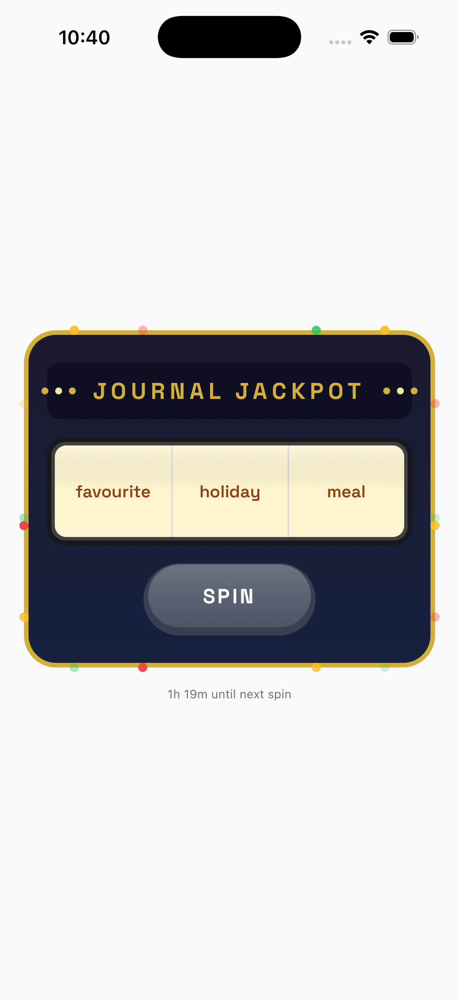
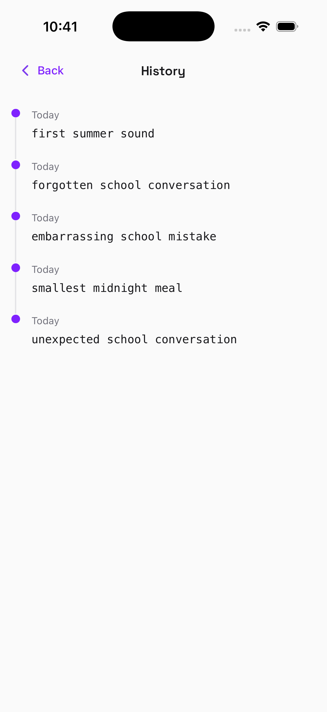

# Journal Jackpot

**Beat the blank page with a spin.**

<table>
  <tr>
    <td></td>
    <td></td>
  </tr>
</table>

## About

Staring at a blank journal page? Journal Jackpot turns prompt selection into a game. Spin the slot machine to get a random journaling prompt, then write. One spin per day keeps it special.

## Features

- **Slot Machine UI** - Skeuomorphic 3-reel machine with animated spins and celebration effects
- **Curated Prompts** - Word combinations across time, emotion, and topic categories
- **Prompt History** - Timeline of past prompts with dates
- **Daily Limit** - One spin per day (unlimited in dev mode)

## Getting Started

Refer to docs at https://docs.expo.dev/ for setting up your environment for
React Native development.

```bash
# Install dependencies
npm install

# Start dev server
npm start

# Run on iOS simulator
npm run ios

# Run tests
npm test
```

